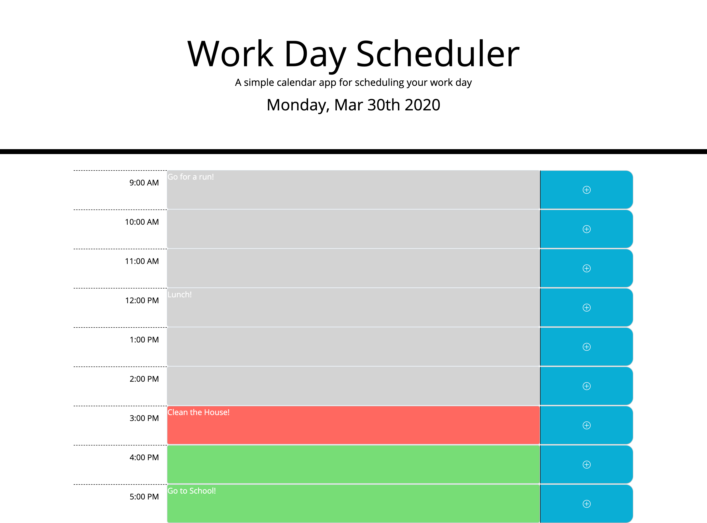

# Work-Day-Scheduler
#### https://jinj95.github.io/Work-Day-Scheduler/

  Enter an activity within a time block of your choice and hit the save button on the right.
  Notice that if you refresh the page the activity will remain within the text area.
  In order to clear the activity erase it in the text area and click save.
  
  I am using moment.js objects to capture the current date and time.
  Every text area is color coded in order to indicate the current time of the day.
  I made this possible by creating a moment object for each time block. Then using isBefore, isAfter, or isSame methods I can   check if the time block hour of the day is before, after, or the same as the current moment object.
  If the text area is gray that means that time has already passed.
  If the text area is red that means the time of day is within that current hour.
  If the text area is green that means that hour is yet to come.
  
